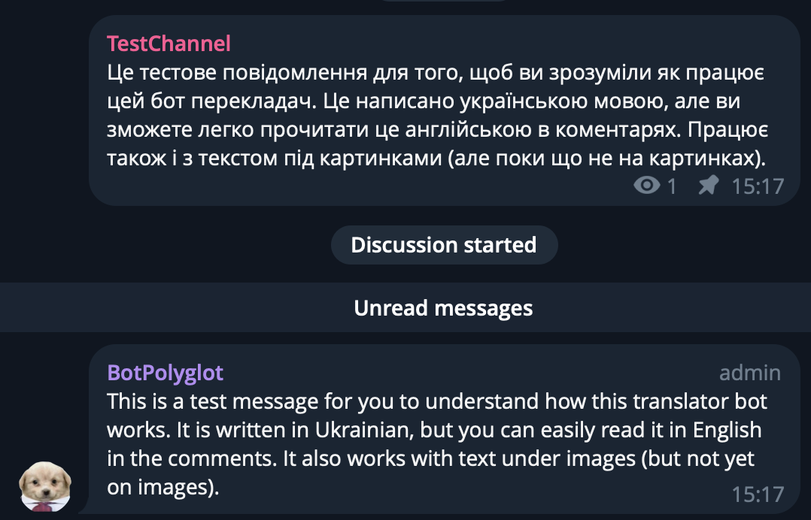

# Bot Polyglot: Telegram Auto Translator 


## Overview

I used this project to enable automatic translation of messages in replies to Telegram channel posts, but basically it can be used
to make any messages postprocessing you want (for example, video-to-text conversion or images analyzing). Technical stack:

- **Programming Language:** Go
- **Translation Service:** DeepL API
- **Messaging Platform:** Telegram API
- **Cloud Services:** AWS Lambda (with API Gateway)
- **CI/CD Pipeline:** Automatic GitHub actions deployment with OIDC AWS authorization
- **Infrastructure Management:** Terraform

### Key Features
1. **It's free:** Until you are fitting to the AWS Lambda and DeepL free tiers (1 000 000 triggers/month + 500 000 symbols/month).
2. **Any language:** Translate messages from any to any language supported by DeepL (that covers most of cases!).
3. **Easy to setup:** Using Terraform and these instructions makes the setup process smooth!
4. **Easy to use:** Once setup is done, it requires only a minute to connect to your Telegram channel.
5. **Great Logo:** Look what a cutie!

### Usage example


---

## Setup Instructions

Follow the steps below to set up your own Telegram Translator (or postprocessor) Bot:

### 1. Logic Code in Go

I don't want to dive into the code details as I don't know Go well and it's pretty simple, and I chose it because of its performance and just to try it.
You can customize the message postprocessing logic with the Go. You can also use any other programming language to write your Lambda function,
but you will need to modify the Terraform script and GitHub actions file accordingly.


#### Customization
To modify or add post-processing logic, rewrite the `HandleRequest` function. For example, you can replace the `translateText` function with custom text analysis, formatting, or another API call.

---

### 2. Setting Up AWS API Gateway and Lambda with Terraform

### Required tools

1. **Install Terraform**  
   Follow the [official guide](https://developer.hashicorp.com/terraform/tutorials/aws-get-started/install-cli) to install Terraform on your system.
   For the MacOS you can simply use Homebrew:
   ```bash
    brew install terraform
    ```

2. **Install AWS CLI**  
   Download and configure the AWS CLI by following [this guide](https://docs.aws.amazon.com/cli/latest/userguide/install-cliv2.html).
   The same, for the MacOS you can use Homebrew:
   ```bash
    brew install awscli
    ```

3. **Create an AWS Account (if needed) and IAM User**  
   - If you don’t have an AWS account, create one at [aws.amazon.com](https://aws.amazon.com/). The AWS Free Tier allows you to test this project at minimal or no cost.  
   - After signing in:
     - Go to the **IAM** service in the AWS Management Console.  
     - Create a new user with `Programmatic access`.  
     - Attach the policies `AdministratorAccess` or at least permissions to manage S3, Lambda, and API Gateway.
     - Under the **Security credentials** tab, click **Create access key** for this user.


4. **Set up AWS Credentials**  
   Run the following command and provide your Access Key ID, Secret Access Key, and default region:
   ```bash
   aws configure
   ```
If credentials are already configured, this step is not required.

---

### 3. Deployment 

1. **Clone the Repository**

2. **Edit Variables**  
   Open the `variables.tf` file and update the required fields:
   - Set a unique value for `unique_s3_bucket_name`. Ensure this name is globally unique (e.g., `my-unique-bucket-12345`).
   - Other variables (e.g., `bot_secret`, `bot_token`, `deepl_auth_key`, and `target_lang`) can be set directly in your code or updated in AWS as environment variables after deployment.

3. **Initialize Terraform**
   ```bash
   terraform init
   ```

4. **Plan the Infrastructure**  
   ```bash
   terraform plan
   ```

5. **Apply the Terraform Configuration**  
   ```bash
   terraform apply
   ```

6. **Retrieve the API Gateway URL**  
   As a result of previous step, everything would be deployed and you will see the API Gateway endpoint in the output. 
   If not, follow these steps:
   Terraform does not always display the API Gateway endpoint in the output. To locate the endpoint:
   - Go to the AWS Management Console.
   - Navigate to **API Gateway > Your API > Stages > Production**.
   - Note the `Invoke URL`. This is your API endpoint and will serve as the webhook URL for your Telegram bot.

   Remember this URL for the Telegram webhook setup.

---

### Cleaning Up Resources

It is best to clean up any unused resources to avoid unexpected charges. AWS generally does not charge for inactive services, but some components (like S3 buckets or Lambda storage) could still incur small costs.

To remove all resources created by Terraform, run:
```bash
terraform destroy
```

Confirm the action by typing `yes` when prompted.

---

### 4. Setting Up Telegram Bot and Webhook

### Creating a Telegram Bot

Before setting up the webhook, you need to create a Telegram bot. Follow these steps:

1. Open Telegram and search for the [BotFather](https://t.me/botfather). This is the official tool for managing bots on Telegram.
2. Start a chat with the BotFather by clicking the "Start" button or sending `/start`.
3. Create a new bot by sending the `/newbot` command.
4. After the bot is created, the BotFather will provide you with a **token**. Make sure to copy and store it securely, as you will need it to configure the webhook.
5. Set this token as the `BOT_TOKEN` environment variable in your Lambda (`AWS -> Lambda -> <your Lambda> -> Configuration -> Environmental variables -> Edit`).

For more information, refer to the [Telegram Bot API documentation](https://core.telegram.org/bots/api).

### Creating a Telegram Webhook

1. Set your Telegram bot webhook by making a POST request to the [Telegram Bot API's `setWebhook` method](https://core.telegram.org/bots/api#setwebhook):
   ```bash
   curl -X POST "https://api.telegram.org/bot<TOKEN>/setWebhook" \
   -H "Content-Type: application/json" \
   -d '{
         "url": "<API_GATEWAY_ENDPOINT>",
         "secret_token": "<SECRET_TOKEN>",
         "allowed_updates": ["message"]
       }'
   ```
- Replace `<TOKEN>` with your Telegram bot token.
- Replace `<API_GATEWAY_ENDPOINT>` with the deployed API Gateway URL.
- Replace `<SECRET_TOKEN>` with the value of the `bot_secret` environment variable configured in your TF. It could be any string you want, it's used for the security check.

**Note:** The `allowed_updates` array specifies the types of updates you want the bot to handle. Remember, that each triggered webhook triggers the Lambda, so customize it carefully. For more details, refer to the [allowed_updates section](https://core.telegram.org/bots/api#getupdates).

---

### 5. Creating a DeepL Account and Generating an API Key

To enable translations in your bot, you need a DeepL API account and a valid API key. Follow these steps to create an account and obtain the key:

1. Visit the [DeepL website](https://www.deepl.com/pro#developer).
2. Choose a suitable subscription plan (select the free tier if you are not planning to use over the 500 000 symbols per month).
3. Sign up or log in to your DeepL account.
4. Navigate to the [DeepL API section](https://www.deepl.com/pro-api).
5. Generate an API key from the dashboard. This key will be used in the bot's environment variables for authentication.
6. Set this key as the `DEEPL_AUTH_KEY` environment variable in your Lambda (`AWS -> Lambda -> <your Lambda> -> Configuration -> Environmental variables -> Edit`).

---

### 6. Make it work!

1. Add the bot to your Telegram channel's discussion group.
2. Set up admin for it:
   - Open your Telegram channel.
   - Navigate to **Admins** and **Add Admin**.
   - Select your bot and grant the required permissions (you can actually just add it as an admin without any permissions).
3. Send the post to the channel.
4. The translated comment from your bot should appear under the post!

**Note:**
Input language of the message is detected automatically by DeepL and the target translation language can be any supported by DeepL - you can specify it with the `TARGET_LANG` environment variable in your Lambda (`AWS -> Lambda -> <your Lambda> -> Configuration -> Environmental variables -> Edit`).
By default, the target language is set to English.

---

### Optional: GitHub Actions CI/CD Pipeline

You can set up a GitHub Actions workflow to automate the deployment of your Lambda function.
This workflow triggers on pushes to the `master` branch and updates the Lambda function code with the latest changes.

### Integration Setup

1. **Enable OIDC for GitHub Actions**:
   Follow these steps to configure the AWS Identity Provider and create the required IAM role for your GitHub repository:

   #### Create an Identity Provider in AWS:
    1. Open the **AWS Management Console** and navigate to the **IAM** service.
    2. In the left navigation pane, select **Identity Providers**.
    3. Click **Add provider** and choose the following settings:
        - **Provider type**: OpenID Connect.
        - **Provider URL**: `https://token.actions.githubusercontent.com`.
        - **Audience**: `sts.amazonaws.com`.
    4. Complete the setup to create the OIDC Identity Provider.

   #### Create an IAM Role for GitHub Actions:
    1. Navigate to the **IAM Roles** section in the AWS Management Console and click **Create Role**.
    2. Choose the **Custom trust policy** option and enter the following JSON trust policy to allow GitHub Actions to assume the role:
       ```json
       {
           "Version": "2012-10-17",
           "Statement": [
               {
                   "Effect": "Allow",
                   "Principal": {
                       "Federated": "arn:aws:iam::<AWS_ACCOUNT_ID>:oidc-provider/token.actions.githubusercontent.com"
                   },
                   "Action": "sts:AssumeRoleWithWebIdentity",
                   "Condition": {
                       "StringEquals": {
                           "token.actions.githubusercontent.com:aud": "sts.amazonaws.com",
                           "token.actions.githubusercontent.com:sub": "repo:<GITHUB_ORG>/<GITHUB_REPO>:ref:refs/heads/master"
                       }
                   }
               }
           ]
       }
       ```
        - Replace `<AWS_ACCOUNT_ID>` with your AWS account ID.
        - Replace `<GITHUB_ORG>` with your GitHub organization or username.
        - Replace `<GITHUB_REPO>` with your repository name.
    3. Click **Next** and attach the necessary policies:
        - **AmazonS3FullAccess** (or a custom policy with `s3:PutObject` and `s3:GetObject` for specific buckets).
        - **AWSLambda_FullAccess** (or a custom policy with `lambda:UpdateFunctionCode` for specific functions).
    4. Name the role (e.g., `GitHubOIDC-LambdaRole`) and complete the setup.
    5. Copy the role's ARN (e.g., `arn:aws:iam::<AWS_ACCOUNT_ID>:role/GitHubOIDC-LambdaRole`).

2. **Add GitHub Repository Secrets**:
    - Go to `GitHub -> Your Repository -> Settings -> Secrets and variables -> Actions -> New repository secret`.
    - Add the following secrets:
        - **`AWS_REGION`**: Your AWS region (e.g., `us-east-1`).
        - **`S3_BUCKET`**: Name of the S3 bucket used for deployment.
        - **`LAMBDA_FUNCTION_NAME`**: Name of your Lambda function.
        - **`CICD_ROLE_ARN`**: The ARN of the OIDC IAM role created above.

3. **Configure the Workflow File**:
   Commit the `.github/workflows/build-and-upload.yml` file to your repository.

---

**Note:**
Once this setup is complete, any changes committed to the `master` branch, particularly within the `go` directory, will trigger the workflow, build the Go application, upload the ZIP file to the specified S3 bucket, and update the Lambda function code automatically. You can further customize the triggers, workflow directory, or other parameters as needed.

## Contributing

Contributions are welcome! Feel free to fork this repository and submit pull requests for enhancements or bug fixes.